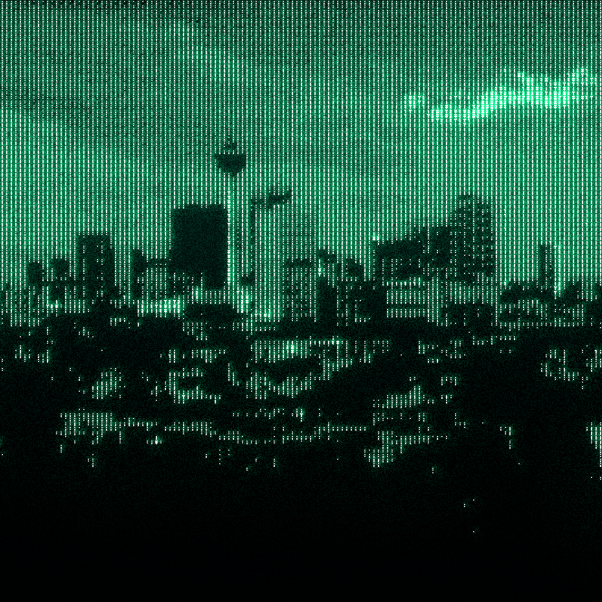
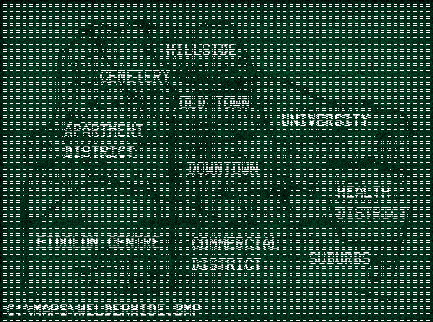

# **Bem-vindos a Welderhide!** {#bem-vindos}

> *“Ad perpetuum structus. - Construída para a Eternidade”*
---

Uma gema escondida no coração dos **vales de ferro** e **rios gelados de Ontario**, **Welderhide** é a joia que coroa a nova era industrial da região.

Outrora uma **pequena cidade mineradora** coberta por fumaça e fuligem, o local se reinventou como um **paraíso de tecnologia limpa** e **estilo de vida moderno**.

Onde antes havia fornalhas, **belos arranha-céus de vidro e aço** agora brilham.

---

Fundada há mais de um século por mineradores e ferreiros, a cidade **ergueu-se das cinzas** (literalmente!) até se tornar um **cartão postal da inovação pós-industrial**.

Hoje, a **Eidolon Systems**, maior contratante de Welderhide, presenteia nossa cidade com uma **malha energética de última geração**, incomparável em todo o mundo por sua **engenharia e baixo custo**.

Nossa energia é **limpa e eficiente**, e nosso povo, **orgulhoso e diverso**.

Eidolon Systems
  

---

Ao cair da noite, o horizonte **exala um brilho azulado**, e a cidade **murmura suavemente**
um tom constante e tranquilo, quase imperceptível para os locais.

As pessoas chamam de **“murmúrio de Welderhide.”**

Cientistas citam **interferência residual** de toda essa nova tecnologia,  
mas alguns acreditam ser **ecos da cidade relembrando com nostalgia o que costumava ser.**

---

Sinta-se em casa.  

Você **se acostuma com a estática**, eventualmente.

---

